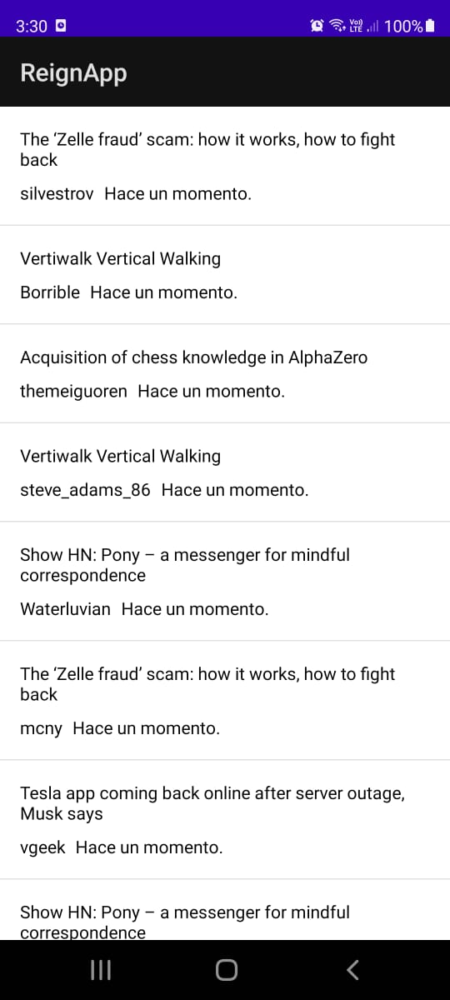
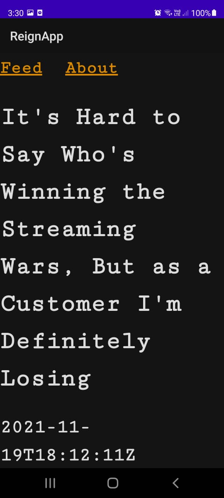
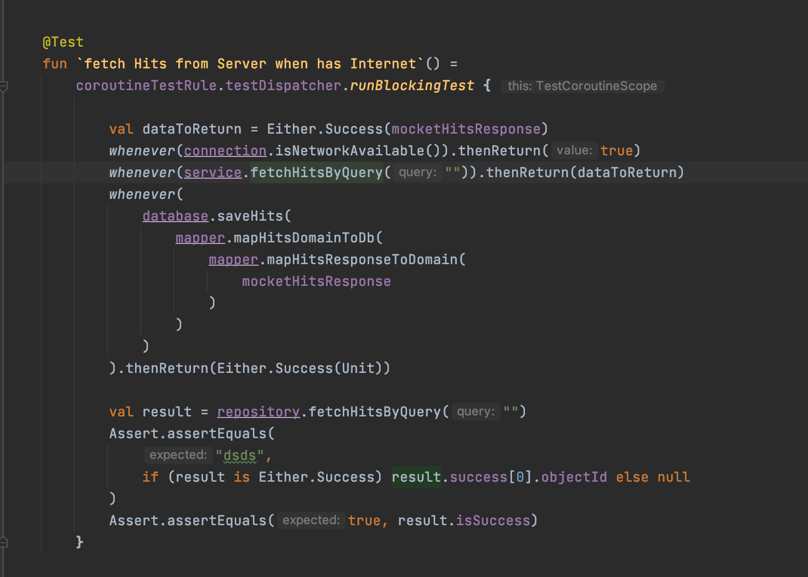
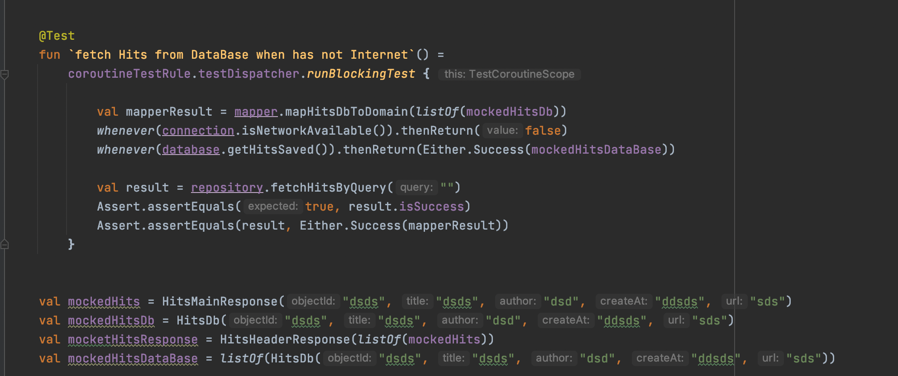
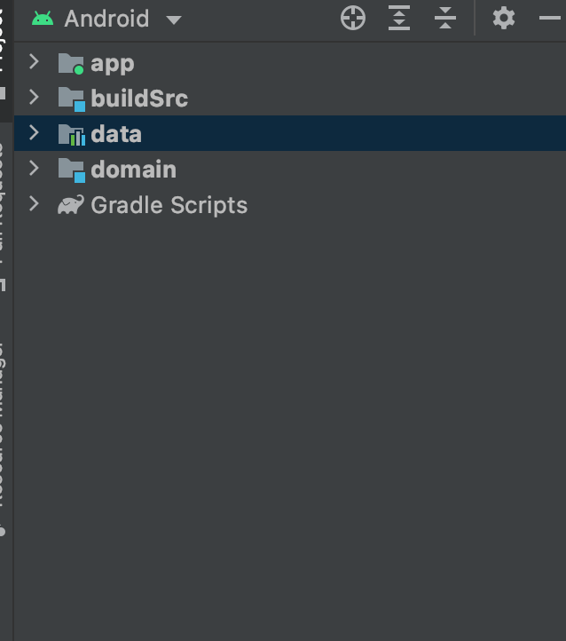

# Android Clean Architecture - Technical Test Reign
_This application show a list of posts online and offline._

## Reasons why you should take some time to review it!
1. Modularization of applications
2. Unit Test
3. Using an internal database
4. Use of coroutines to manage processes
5. Using MVVM as a presentation architecture pattern
6. Principles Solid
7. Using a dependency injector
8. Use of Rest services

&nbsp;&nbsp;&nbsp;&nbsp;&nbsp;&nbsp;&nbsp;&nbsp;&nbsp;&nbsp;&nbsp;&nbsp;

## Architecture

The architecture of the project follows the principles of Clean Architecture and Solid Principles.
The layers are modularized as follows:

## Link Of Apk

## Autor
* **José Edmundo Prado Astucuri** - [DevEd20m](https://github.com/DevEd20m)
